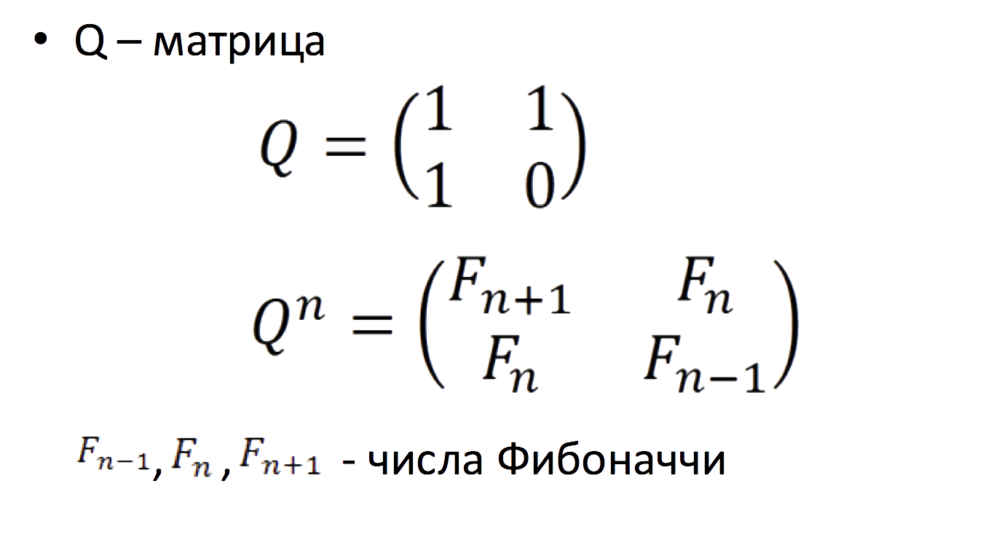
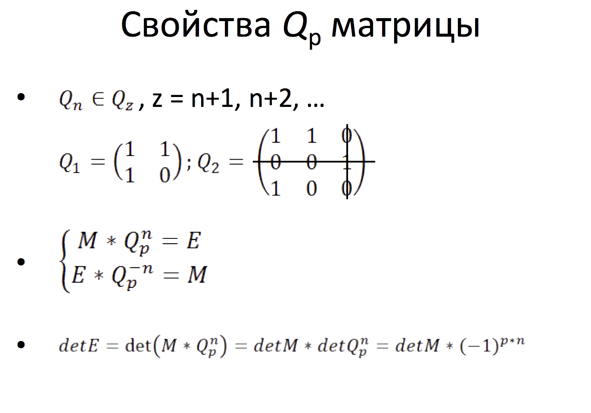
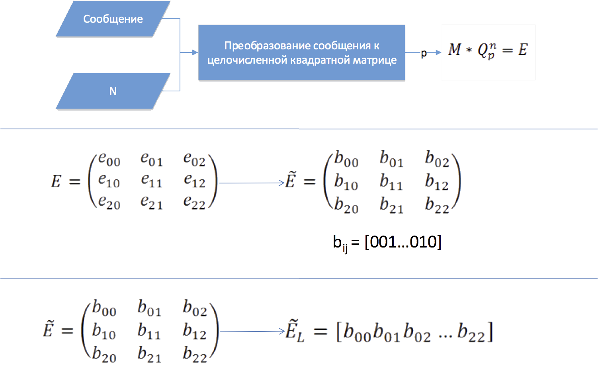
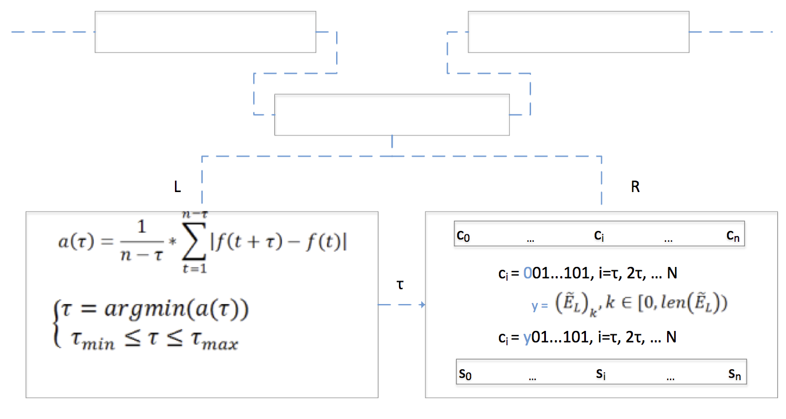
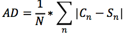
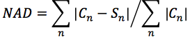
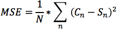
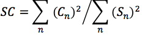

# gs-scrambler

*Дипломный проект, 2015*

**Программное обеспечение для скрытия цифровой информации внутри аудиосигнала в потоковом режиме.**

## Оглавление

- [Особенности](#особенности)
- [Структурная схема](#структурная-схема)
- [Помехоустойчивое кодирование](#помехоустойчивое-кодирование)
- [Скрытие / Извлечение](#скрытие--извлечение)
    - [Классический НЗБ-метод](#классический-нзб-метод)
    - [Сдвиговая функция Альтера-Джонсона](#сдвиговая-функция-альтера-джонсона)
- [Особенности реализации потокового алгоритма](#особенности-реализации-потокового-алгоритма)
    - [Эффект отброшенных кадров](#эффект-отброшенных-кадров)
    - [Синхронизация](#синхронизация)
- [Схема алгоритма](#схема-алгоритма)
- [Совместное использование c другими приложениями](#совместное-использование-c-другими-приложениями)
- [Оценка качества системы](#оценка-качества-системы)
- [Использование](#использование)
- [Зависимости](#зависимости)
- [Подготовка](#подготовка)
- [Запуск](#запуск)
- [Литература](#литература)
- [Лицензия](#лицензия)

## Особенности

* Выполнение скрытия/извлечения в потоковом режиме.

* Шифрование сообщения перед интеграцией.

* Применение помехоустойчивого кодирования, основанного на обобщённых матрицах Фибоначчи.

* Применение сдвиговой функция Альтера-Джонсона в качестве генератора псевдослучайной схемы интеграции.

* Разработка ядра программы на C++ для решения "dropped frames" эффекта.

* Маркировка сигнала для обеспечения синхронизации при извлечении информации из потока.

* Возможность совместного использования c другими аудиоприложениями.

* Положительные показатели при оценке системы разностными и корреляционными показателями искажения

## Структурная схема

Структурная схема алгоритма, в которой представлены основные его составляющие отдельно для режима встраивания и извлечения. 

    <i> Рис. 1. Структурная схема. </i>

Алгоритм может находиться лишь в одном из двух состояний: 

* Состояние, при котором происходит встраивание информации в аудиосигнал;  

* Состояние, при котором происходит извлечение информации из аудиосигнала.

Так как процесс встраивания/извлечения должен происходить достаточно быстро для того, чтобы уложиться во время допустимой задержки, блоки кодирования и декодирования вынесены за пределы «потоковой» части алгоритма и выполняются до начала встраивания сообщения и после завершения извлечения.

Параметры, необходимые для извлечения сообщения на схеме содержатся внутри «Ключ*». Они известны уже на этапе кодирования и могут быть переданы получателю до начала процесса встраивания по открытому каналу, ввиду их неприметности. Блок синхронизации выполняется всего лишь раз в режиме встраивания, перед интеграцией сообщения, а в режиме извлечения до тех пор, пока не будет выполнена синхронизация.

## Помехоустойчивое кодирование

Для осложнения процесса получения доступа при неправомерном извлечении данных, применяется шифрование, основанное на обобщённых матрицах Фибоначчи, представленных Алексеем Павловичем Стаховым в [1,2]. 

|  |  |
| -------- | -------- |
|      |       |
| а) | б) |
|      | |
| в) | г)|

    <i> Рис. 2. а) Классическая Q-матрица (матрица Фибоначчи); б) Qp-матрица; в) Свойства Qp-матрицы. г) Процесс подготовки сообщения к встраиванию </i>

Процесс подготовки сообщения к встраиванию (г) состоит из следующих этапов:
* Преобразование сообщения к целочисленной матрице
* Умножение на Qp матрицу
* Перевод каждого элемента матрицы к 2ой СС
* Линеаризация

## Скрытие / Извлечение

Потоковая стеганография добавляет требования к стеганосистеме, а именно: сложность системы, пропускная способность, полоса пропускания, задержка, отсутствие дублирования, время восстановления, время на подготовку системы. 
В таблице 1. представлена оценка базовых алгоритмов для использования в потоковом режиме [3].

    <i> Таблица 1. Оценка применимости алгоритмов для потоковых аудио контейнеров [3]. </i>

  

| Алгоритм | Вместительность | Уровень скрытности | Устойчивость | Применение в потоковых контейнерах |
| -------- | -------- | -------- | -------- | -------- |
| **НЗБ**|Выс.|Сред.|Низ.|Выс. |
| **Фазовое кодирование**|Низ.|Выс.|Выс.|Сред. |
| **Расширение спектра**|Выс.|Низ.|Выс.|Низ. |
| **Эхо-сигнал**|Выс.|Низ.|Сред.|Сред. |

Из перечисленных алгоритмов лучше всего удовлетворяет требованиям НЗБ метод. Основными недостатками этого метода являются: относительно низкая устойчивость к искажениям и к стеганодетекторам. Однако они скорее характерны для контейнеров фиксированного типа. В потоковых контейнерах сложнее определить наличие скрытого сообщения. Проблема искажений в первую очередь актуальна для интеграции синхронизирующих маркеров. Для реализации потокового алгоритма был выбран именно НЗБ метод, в качестве базового механизма встраивания. Для компенсации недостатков алгоритма были внедрены:

* сдвиговая функция Альтера-Джонсона в качестве генератора псевдослучайной схемы интеграции для повышения устойчивости к стеганодетекторам

* Помехоустойчивое кодирование, основанное на обобщённых матрицах Фибоначчи для обеспечения шифрования и возможности восстановления сообщения при искажениях.

### Классический НЗБ-метод

Обыкновенное встраивание НЗБ-методом осуществляется следующим образом:

Пусть имеется порция сигнала p, подлежащая обработке p = {z1, z2, z3, … }, где

Выделенные биты заменяются на биты скрываемого сообщения:  

Модифицированная порция сигнала равна:

При встраивании НЗБ-методом требуется определить шаг, с которым осуществляется интеграция информации, поскольку именно от этого зависит пропускная способность и уровень скрытности. В данной работе предлагается использовать сдвиговую функцию Альтера-Джонсона для вычисления шага, с которым будут встраиваться биты.

### Сдвиговая функция Альтера-Джонсона

Основное применение функции Альтера-Джонсона – определение значений, наиболее близких к периодам, в данных, имеющих нелинейные колебания [4]. 
Для дискретного случая, если n - общее число отсчётов функции f(t), заданной экспериментальными значениями, вводится следующая функция для определения почти периодов:

Система почти - периодов τ функции f(t) может быть определена как совокупность локальных минимумов сдвиговой функции

где τ_min и τ_max - естественные пределы поиска периода.

Полученный почти-период используется в качестве шага для осуществления встраивания сообщения. Такой подход позволяет всегда получать уникальную схему встраивания, что увеличивает устойчивость к стеганодетекторам. Пропускная способность сильно зависит от типа аудиоконтейнера и размера фрейма. Возникновение крайних, нежелательных случаев возможно, например, когда  τ = 1, но их можно искусственно изолировать. Во время проверки алгоритма, как правило, приходилось сталкиваться с обратной ситуацией. Чем выше значение, тем меньше пропускная способность, но выше уровень скрытности. Так как алгоритм ориентирован на потоковый контейнер, то предпочтение отдаётся именно безопасности. И хотя в случае с потоковым контейнером его длина заранее неизвестна и нельзя гарантировать, что сообщение полностью поместится в контейнере, тем не менее, возможно контролировать длину этого контейнера, если влиять на потоковый контейнер (например, самостоятельно осуществлять запись нужной длины).

Операция определения шага с помощью сдвиговой функции происходит как при встраивании, так и при извлечении сообщения. Чтобы значение шага при извлечении совпадало с исходным значением, в алгоритме используются два аудиоканала. Например, левый для определения шага, а правый для скрытия данных. Левый канал при этом не претерпевает изменений.

|  |  |
| -------- | -------- |
|      |      |
| а) | б) |

    <i> Рис. 3. а,б) Определения шага с помощью сдвиговой функции в левом канале и интеграция закодированного сообщения в правый канал. </i>

## Особенности реализации потокового алгоритма

### Эффект отброшенных кадров

    <i> Рис. 4.  Эффект отброшенных кадров. </i>

Решался оптимизацией алгоритма и совместным использованием C++ и Python (Cython) при разработке.

### Синхронизация

    <i> Рис. 5. Проблема синхронизации при поиске маркера начала скрытой информации. </i>

Для того чтобы успешным образом извлечь сообщение достаточно сохранять дополнительно ещё хотя бы две порции аудиосигнала, последовательно поступающие на вход. Заранее зная значение маркера и, приведя его к нужному виду, его местоположение можно достаточно быстро определить, не выполняя никаких операций декодирования, а просто осуществляя поиск внутри накопительного массива.

    <i> Рис. 6. Решение проблемы синхронизации при помощи буферизации и быстрого поиска. </i>

Поиск маркера должен быть быстрым, чтобы не превысить допустимую задержку. Длина «порции» звука (фрейма) может быть равна frame_size = 512, 1024, 2048 … p, где p ограничено частотой дискретизации аудиофайла и возможностями системы. Для накопительного буфера достаточно размера, превышающего frame_size в 3 раза. Допустимую скорость можно получить, реализовав поиск, схожий с поиском подстроки.

## Схема алгоритма

На рис. 7. представлена полная схема стеганографического алгоритма.

    <i> Рис. 7. Полная схема предложенного стеганографического алгоритма. </i>

## Совместное использование c другими приложениями

Возможность совместно использовать программное обеспечение, использующее представленный алгоритм, с другими программами позволит существенно расширить область применения и  удобство в использовании.
Для этого необходимо установить расширение, для операционной системы, которая добавит к стандартным аудио-входу (например, линейный вход) и аудио-выходу (наушники, динамики) дополнительные виртуальные аудиоустройства. В любой аудиопрограмме можно выбрать входное и выходное устройство. Если требуется перенаправить звук с скрытым сообщением в другую программу, то в этой программе в качестве входа будет выбрано виртуальное аудиоустройство. Если звук принимается из другой программы в качестве контейнера для секретного сообщения, либо уже содержит скрытую информацию внутри и требует извлечения, то в этой программе виртуальное аудиоустройство устанавливается в качестве выхода.  Например, для операционной системы OS X в качестве системного расширения можно использовать SoundFlower, которое добавит 2х-канальное и 64-канальное аудиоустройства. 

    <i> Рис. 8. Схема совместного использования c другими приложениями. </i>

## Оценка качества системы

Для оценки качества полученной системы использовались наиболее распространённые показатели искажений, которые основаны на анализе структуры контейнера. Специально для этих целей был разработан отдельный программный модуль [gs-analyzator](https://github.com/Galarius/gs-analyzator).

Для оценки выбрано два типа контейнера: контейнер, содержащий речь и музыку. Для каждого из них применялся один из следующих двух режимов алгоритма: с упором на безопасность и с повышенным уклоном на ёмкость (таблица 2).

    <i> Таблица. 2. Тестовые данные для оценки. </i>

| №|Содержимое контейнера|Длительность, сек.|Размер, Кб|Режим алгоритма |
| -------- | -------- | -------- | -------- | -------- |
| 1|Речь|120|21 708.8|безопасность |
| 2|Музыка|9|537|вместительность |

В режиме повышенной вместительности, значение почти-периода (см. «Сдвиговая функция Альтера-Джонсона») применяется только для обозначения начала встраивания, а сам шаг равен 1. В режиме повышенной безопасности шаг равен почти-периоду.

В качестве скрываемой информации был выбран следующий текст:

>In the field of audio steganography, fundamental spread spectrum (SS) techniques attempts to distribute secret data throughout the frequency spectrum of the audio signal to the maximum possible level.

Для интеграции такого текста потребовалось 1600 бит. Сам процесс встраивания секретной информации можно охарактеризовать следующими величинами:

* Количество сэмплов в одном фрейме, **SPF**;
* Частота дискретизации аудиопотока, **SR**;
* Количество фреймов, в которых были спрятаны части информации, **FC**;
* Длительность той части аудиосигнала, которая содержит секретную информацию, **D**;
* Среднее количество бит, которое было спрятано в одном фрейме, **BPF**;
* Средняя скорость, с которой происходило встраивание информации, **BPS**.

    <i> Таблица. 3. Отчёт об интеграции сообщения в контейнеры №1 и №2. </i>

| № контейнера|SPF|SR, Гц|FC|D, мс|BPF, бит/фрейм|BPS, бит/сек |
| -------- | -------- | -------- | -------- | -------- | -------- | -------- |
| 1|1024|44100|1469|34110|2|50 |
| 2|1024|44100|10|232|360|8000 |

Вычисление длительности той части аудиосигнала, которая содержит секретную информацию (**D**), производилось по формуле:

В таблице 4 отображены итоговые показатели качества.

    <i> Таблица. 4. Итоговая таблица показателей. </i>

| №|Название показателя|Формула|Оригинал|Результат 1|Результат 2 |
| -------- | -------- | -------- | -------- | -------- | -------- |
| 1|Максимальная разность||0|1|1 |
| 2|Средняя абсолютная разность||0|0.0005|0.02 |
| 3|Нормированная средняя абсолютная разность||0|5.5*10^(-7)|4.1 * 10^(-6) |
| 4|Среднеквадратическая ошибка||0|0.0005|0.02 |
| 5|Нормированная среднеквадратическая ошибка||0|1.4*10^(-10)|5.6*10^(-10) |
| 6|Lp- норма, p = 2||0|0.02|0.15 |
| 7|Отношение «сигнал/шум»||inf|7.0*10^9|1.8*10^9 |
| 8|Максимальное отношение «сигнал/шум»||inf|2*10^12|4.9*10^10 |
| 9|Качество звучания||1|~1|~1 |
| 10|Нормированная взаимная корреляция||0.0004, 1.15*10^(-5)|0.0004|1.16*10(-5) |
| 11|Качество корреляции||255409, -5.15|255410|-5.19 |
| 12|Структурное содержание||1|~1|~1 |

Результаты для обоих случаев практически не отличаются от оригинала, что доказывает работоспособность системы и допустимый уровень качества. 

## Использование

Результат работы представлен в виде программы с интерфейсом командной строки. 

    <i> Рис. 9. Вид программы. </i>

Имеется встроенная документация, доступ к которой можно получить,введя команду **help**. Программа позволяет выбирать в качестве аудиовхода/выхода не только встроенные и виртуальные аудиоустройства, но и файлы формата wave. С помощью инструкций hide/recover выполняется скрытие/извлечение. С описанием каждой инструкции и её параметрами можно ознакомиться, введя в командной строке **help hide**/**help recover**.

Имеются следующие ограничения:

* Если одновременно существуют отправитель и получатель, то канал связи между ними не должен прерываться для успешного выполнения синхронизации;

* Аудиоконтейнер должен иметь 2 канала.

## Зависимости

* `pip install cython`
* `brew install portaudio`
* `pip install --global-option='build_ext' --global-option='-I/usr/local/include' --global-option='-L/usr/local/lib' pyaudio`

## Подготовка 

* Построение: `python setup_cy.py build_ext --inplace`
* Настройка: [settings.json](settings.json)

## Запуск 

* `python gs_scrambler.py -s` - потоковый интерактивный режим
* `gs_scrambler.py -i <input_container_file_name> -m <message_file_name> -o <output_container_file_name> -k <key> [-r <recover_info_file_name>]` - скрытие в фиксированном контейнере
* `gs_scrambler.py -i <input_container_file_name> -m <message_file_name> -k <key> (-l <message_length> or -r <recover_info_file_name>)` - извлечение из фиксированного контейнера

## Литература

1. Stachov A.P. [The Mathematics Of Harmony](https://books.google.ru/books?id=K6fac9RxXREC&pg=PA330&lpg=PA330&dq=Alexey+Stakhov+Qp+matrix&source=bl&ots=vKwnx8iN0H&sig=0E54t1v2pPv2VojDGc-quMgCAnE&hl=ru&sa=X&ved=0CCoQ6AEwAWoVChMI7buUiPrpxgIVqv5yCh3I6wZ3#v=onepage&q&f=true), World Scientific Publishing Co. Ltd, 2009, Chapter 6.3. Generalized Fibonacci Qp - Matricies.

2.	А.П. Стахов, Компьютеры Фибоначи и новая теория кодирования: история, теория, перспективы. 

3.	A Survey on Steganography Techniques in Real Time Audio Signals and Evaluation, International Journal of Computer Science Issues, Vol. 9, Issue 1, No 1, January 2012

4. В.И.Кузьмин, А.Ф. Гадзаов, Методы построения моделей по эмпирическим данным, МИРЭА , Москва, 2012  —  96 стр.

# 
[Расчетно-пояснительная записка, 2015 (полная версия)](gs-scrambler.pdf)
#

## Лицензия

 Материал, описывающий «gs-scrambler» и созданный автором по имени Шошин Илья Сергеевич (Galarius), публикуется на условиях <a rel="license" href="http://creativecommons.org/licenses/by-nc-nd/4.0/">лицензии Creative Commons «Attribution-NonCommercial-NoDerivatives» («Атрибуция — Некоммерческое использование — Без производных произведений») 4.0 Всемирная</a>.

Исходный код «gs-scrambler» выложен на условиях [GNU GPLv3](https://choosealicense.com/licenses/gpl-3.0/#)